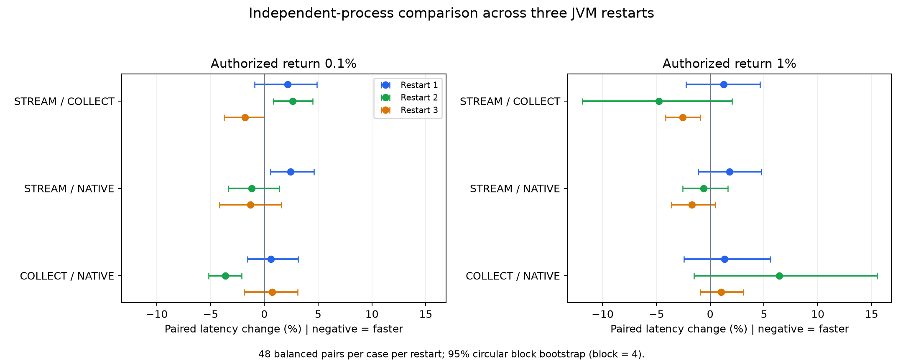

# 0.1% / 1% 四方法隔离与独立重启复测

本次针对此前小结果集结论反转，比较旧COLLECT、新STREAM、真实Ranger原生基线与INLINE。只改变测试部署与对照组织，没有再次修改FGAC算法。

## 本轮结论

三次独立重启等权平均，STREAM相对Native在0.1%为-0.003%（基本持平），1%为-0.181%。各次重启分别为0.1%：+2.43%、-1.16%、-1.28%；1%：+1.79%、-0.61%、-1.72%。此前八场景单轮的+11.50% / +3.57%没有以相同幅度复现，不能继续将其解释为方案固有的稳定劣化。

STREAM相对COLLECT的三轮均值为0.1% +1.00%、1% -2.03%，但逐轮方向不同，且1%第二轮COLLECT有连续慢查询；不能据合并均值宣称新交付在小结果集稳定退化或稳定加速。STREAM相对INLINE仍平均慢约8.14% / 6.90%，说明与真实授权基线持平并不等于消除了所有治理和跨引擎成本。

本轮六个STREAM/Native区间上界均小于+5%，支持当前针对性暖态测试下的小查询开销较低；仅三次重启、同一数据集和改变后的两场景混合，不足以保证任意工作负载或八场景混合都低于5%。之前单轮的置信区间只刻画该会话内样本，不能覆盖全部会话状态及工作负载变化。

对先前解释的修正：固定开销和小结果集缺少流水线重叠空间可以解释机制，但不能单独解释前后报告的反转。此轮尚未单变量隔离“八场景/两场景查询混合、预热历史、JIT、背景活动”的贡献，不将具体原因归定为其中任何一项。

## 口径与隔离

- 三轮独立重启；每轮四个独立E Spark/Python会话，COLLECT与STREAM各有独立R Spark/Python服务。R端18840/18841，方法间不共享SparkContext、JIT、Arrow队列；E临时目录按方法隔离，R按轮次/方法隔离。
- 测试查询串行交错；四方法24种顺序每场景各出现2次，每轮48组。场景顺序随机，每轮种子91601/91602/91603；启动顺序轮换，预热顺序随机。
- 每轮每方法80次预热，0.1%/1%各40次；每轮320次预热、384次正式查询，三轮合计960次预热、1152次正式查询。没有根据结果改变预热量、提前停止或剔除慢样本。
- 同一Iceberg快照6896028106384817739、四列、行策略与业务条件；count及双xxhash64全量摘要均在计时内。每轮权限负向检查、前中后快照检查、Ranger策略前后不变。
- E均local[2]/2GiB，FGAC各自额外使用R local[2]/2GiB；不设置总CPU配额或绑核。8192行批次、无压缩，消费者相同。COLLECT与STREAM只切换远端交付实现。
- 共用物理主机、MinIO、Polaris/Catalog和Ranger服务，保留正常暖缓存；未清空OS缓存，也未停止原业务。进程隔离不等于主机/共享缓存完全隔离。
- **本轮只混合两个小结果集场景；旧报告混合八个场景。** 因此本轮是针对性复现，不是将旧实验全部条件固定后的单变量重跑，不能将跨报告差值全归因于算法。

## 各次重启结果

耗时为中位数；百分比是同轮配对比值的平均。负值表示前者更快。95%区间用每轮3000次循环块bootstrap，块长4；不把144组当成144次独立部署。

| 重启 | 场景 | Native ms | Inline ms | COLLECT ms | STREAM ms | STREAM/Native | COLLECT/Native | STREAM/COLLECT |
|---|---|---:|---:|---:|---:|---:|---:|---:|
| 1 | 0.1% | 362.25 | 341.82 | 361.11 | 369.66 | +2.43% | +0.61% | +2.17% |
| 1 | 1% | 368.04 | 345.79 | 366.93 | 372.51 | +1.79% | +1.33% | +1.24% |
| 2 | 0.1% | 370.65 | 349.01 | 354.37 | 362.89 | -1.16% | -3.61% | +2.63% |
| 2 | 1% | 373.70 | 359.78 | 371.59 | 374.30 | -0.61% | +6.41% | -4.77% |
| 3 | 0.1% | 379.78 | 339.75 | 378.16 | 372.50 | -1.28% | +0.74% | -1.81% |
| 3 | 1% | 381.77 | 344.78 | 388.33 | 371.95 | -1.72% | +1.01% | -2.55% |

三次重启等权平均如下；仅三次重启，不用一个狭窄的合并区间掩盖轮间差异。

| 场景 | STREAM/Native | COLLECT/Native | STREAM/COLLECT | STREAM/Inline |
|---|---:|---:|---:|---:|
| 0.1% | -0.00% | -0.75% | +1.00% | +8.14% |
| 1% | -0.18% | +2.92% | -2.03% | +6.90% |

## 首批与分区探针

| 重启 | 场景 | 批数 | Arrow逻辑字节 | 首批早于首分区完成 | 提前量中位数 ms |
|---|---|---:|---:|---:|---:|
| 1 | bob_001 | 3 | 62804 | 0/48 | -0.087 |
| 1 | bob_01 | 4 | 627200 | 47/48 | 15.425 |
| 2 | bob_001 | 3 | 62804 | 1/48 | -0.091 |
| 2 | bob_01 | 4 | 627200 | 48/48 | 15.800 |
| 3 | bob_001 | 3 | 62804 | 0/48 | -0.094 |
| 3 | bob_01 | 4 | 627200 | 48/48 | 15.702 |

0.1%只有3批，1%只有4批，均来自3个源分区。大结果集原先的分区内部多批等待在这里大幅缩小；首批提前也不保证最终完成提前，因为仍需等剩余分区及E端完整消费。Arrow逻辑字节不能替代TCP通信字节，本轮没有新增逐连接字节探针。

## 第二轮COLLECT慢查询诊断

第二轮1%场景48次中，有16次超过450 ms。这里的阈值仅用于事后定位，全部48次均保留在主统计中。慢组/其余组端到端中位数为478.98 / 360.10 ms，R流阶段为399.33 / 283.13 ms；R任务累计CPU为461.56 / 286.75 ms，任务累计墙钟为515.50 / 336.00 ms。两组源读取均为8,493,289字节、2,964,624行，任务GC中位数均为0。

证据将差异定位到了R扫描/执行阶段的变化，而不只是传输字节或Catalog准备；但任务CPU及GC指标不足以进一步确定JIT、代码执行或调度的具体原因，尤其不能据GC中位数为0断言没有GC影响。这也说明“旧COLLECT更慢”的一部分可能来自特定会话状态，不能全部计为新交付收益。

## 校验与负载

Spark事件校验覆盖3168个E/R查询组，失败任务/作业0，内存spill 0字节，磁盘spill 0字节。所有结果及schema一致，四方法计时区间无重叠。

| 角色 | 重启 | 主机CPU均值 | 峰值 | iowait均值 | swap-in/out页 |
|---|---|---:|---:|---:|---:|
| R | 1 | 3.40% | 8.08% | 0.00028% | 0/0 |
| R | 2 | 2.92% | 8.76% | 0.00049% | 0/0 |
| R | 3 | 4.00% | 6.94% | 0.00022% | 0/0 |
| E | 1 | 2.96% | 6.77% | 0.00079% | 0/0 |
| E | 2 | 2.86% | 4.36% | 0.00083% | 0/0 |
| E | 3 | 2.93% | 5.36% | 0.00087% | 0/0 |

以上为整机平均，不证明没有单核、GC/JIT或短时调度干扰。后台进程证据保留在load-summary.json及原始资源采样。每轮测试进程均退出后才启动下一轮；最终隔离端口关闭，原服务PID和健康状态保持正常，E配置哈希不变。

## 复现材料

- benchmark.py / worker.py / manage_r.py / serve_compression.py：启动及对照脚本。
- summary.json / pairs.csv / metrics.json：各轮配对差异、分段结果与阶段耗时。
- stage-summary.json / stage-validation.json / probe-summary.json：Spark任务与交付探针。
- r/、e/：每轮查询记录、协议、顺序、快照、权限控制和清理证据。
- 大体积任务事件及全进程采样保留在R `/data1/lyb/fgac-lab/runs/alignment-isolated-0915/` 与E `/home/lyb/fgac-lab/runs/alignment-isolated-0915/` 的evidence-R/E.tar.gz；取回、解压到本地r/e后运行analyze.py、analyze_stages.py、analyze_load.py和aggregate.py。凭据不发布。
