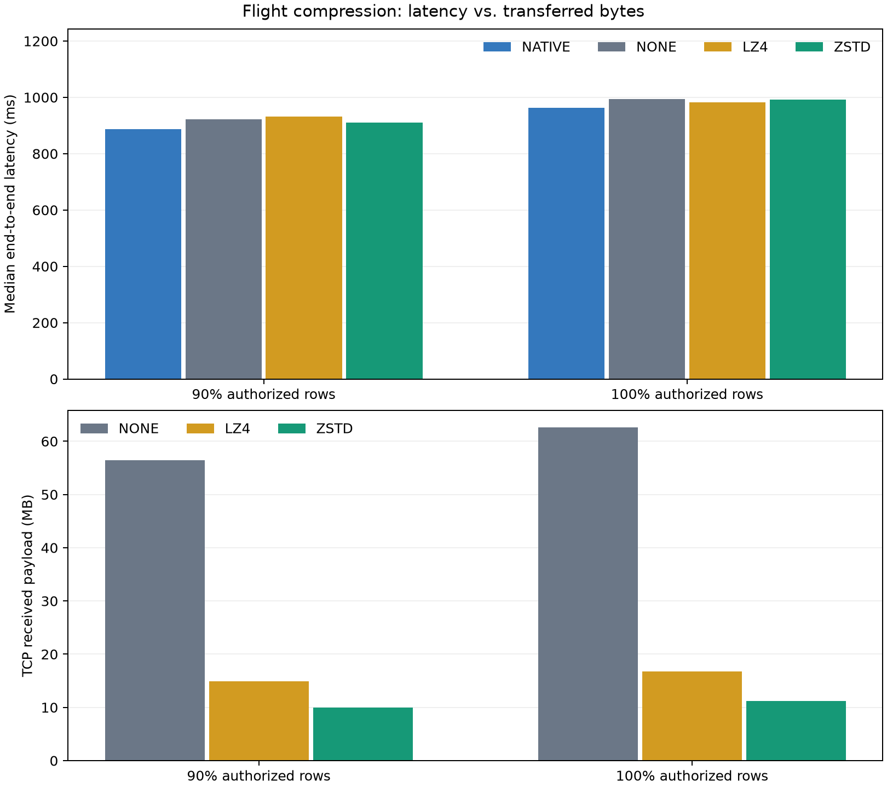

# Arrow Flight 压缩实现与性能测试

日期：2026-09-15。已实现可选 LZ4 / Zstd 压缩，并在隔离的实际 R/E 环境完成对照。默认仍为无压缩，原有 18815 服务未切换；本轮仅改变 Flight 输出的 Arrow IPC 压缩，不改变行过滤、字段类型、字典编码、批次大小或 Spark 分区收集方式。

## 结果

两场景等权的配对耗时变化，相对同轮无压缩 FGAC：LZ4 **-0.72%**，Zstd level 1 **-0.55%**。负值表示更快。具体置信区间与漂移见下表，不能把两场景均值推广到任意负载。

**压缩已显著降低通信字节，但未证实稳定降低查询延迟。** 两种 codec 在两场景的区块 bootstrap 区间都覆盖零；本轮不足以认定稳定加速，也不是性能完全等效的证明。建议在当前部署保持默认无压缩，将压缩作为带宽更紧张环境的可选配置，不继续仅为提高压缩率叠加字典编码。

正式 384 次查询、常规预热 160 次、补齐原生会话预热 80 次全部成功；四路径行数、四列类型、双 xxhash64 摘要逐组一致；408 次 FGAC 流均有完成审计。41 项传输单元测试通过，包括两种压缩下的授权、错误、空结果，以及在生产者结束前已收到首批的验证。

## 耗时对比

单位 ms，耗时为独立中位数/P95；相对变化为每组比值的算术平均，不是中位数之比。区间为长度 4 的循环移动区块 bootstrap 95% 区间；普通 bootstrap 区间也保存在 summary.json。该区间只描述本轮运行内的采样变化。

| 场景 | 路径 | 中位数 ms | P95 ms | 相对无压缩变化及区间 | 相对原生平均劣化 |
|---|---|---:|---:|---:|---:|
| bob_90 | NATIVE | 886.6 | 940.4 | -5.15% [-7.72%, -2.91%] | +0.00% |
| bob_90 | NONE | 922.8 | 1111.9 | +0.00% [+0.00%, +0.00%] | +6.27% |
| bob_90 | LZ4 | 932.6 | 1017.7 | -0.39% [-2.73%, +1.87%] | +5.15% |
| bob_90 | ZSTD | 910.0 | 1058.2 | -1.13% [-3.05%, +0.78%] | +4.45% |
| bob_100 | NATIVE | 963.1 | 1020.1 | -3.27% [-5.08%, -1.66%] | +0.00% |
| bob_100 | NONE | 994.6 | 1101.1 | +0.00% [+0.00%, +0.00%] | +3.77% |
| bob_100 | LZ4 | 983.0 | 1055.3 | -1.05% [-2.16%, +0.02%] | +2.49% |
| bob_100 | ZSTD | 992.0 | 1108.4 | +0.03% [-1.53%, +1.71%] | +3.67% |

连续 16 组的压缩/无压缩配对平均变化：

| 场景 | 压缩 | 第 1–16 组 | 第 17–32 组 | 第 33–48 组 |
|---|---|---:|---:|---:|
| bob_90 | LZ4 | -1.97% | -1.03% | +1.82% |
| bob_90 | ZSTD | -3.92% | +0.40% | +0.14% |
| bob_100 | LZ4 | -1.22% | +0.07% | -2.00% |
| bob_100 | ZSTD | -1.24% | +0.78% | +0.54% |

本轮无压缩 FGAC 相对原生的劣化为 90% 场景 +6.27%、100% 场景 +3.77%；上轮独立复测为 +13.62% / +16.68%。以 100% 为例，上轮原生/无压缩中位数 896.4 / 1043.6 ms，本轮 963.1 / 994.6 ms。**无压缩对照自身也发生变化，不能把跨轮差异算成压缩收益，更不能据本轮低于 5% 的点估计宣布通用性能目标已经完成。** 本轮使用新的隔离 R JVM、不同查询混合与更长 E 预热；具体跨轮变化未被单变量隔离。压缩的主要因果对照是同轮、同 R/E Spark 下 codec 与 NONE 的配对结果。

## 实际传输字节

正式计时结束后单独进行 30 次传输探针，每场景/codec 各 5 次；直接读取完整 Flight 流，在连接关闭前读取 Linux TCP socket bytes_received。匹配专用目的端口且要求恰好一条连接，避免混入其他服务。该指标是 TCP 接收数据字节，包含 Flight/gRPC 控制及帧开销，不含链路层/IP/TCP 头，也不等于含重传的物理网卡流量。

这些探针不执行 E Spark 摘要，不参与性能统计；性能结果来自上一节相同完整消费边界的正式测量。wire-smoke.json 中首次源启动的耗时不用于性能结论。

| 场景 | 路径 | TCP 接收 MB，中位数 | 比无压缩减少 |
|---|---|---:|---:|
| bob_90 | NONE | 56.41 | 0.00% |
| bob_90 | LZ4 | 14.95 | 73.49% |
| bob_90 | ZSTD | 10.02 | 82.23% |
| bob_100 | NONE | 62.65 | 0.00% |
| bob_100 | LZ4 | 16.79 | 73.20% |
| bob_100 | ZSTD | 11.22 | 82.09% |

审计 arrow_bytes 始终表示解压后逻辑数据量，压缩前后相同；不能用它计算通信节省。实际 TCP 字节已独立证明压缩生效。

## 阶段与计算成本

| 场景 | 路径 | 首批到 E ms | prepare ms | action ms | E+R 进程 CPU ms |
|---|---|---:|---:|---:|---:|
| bob_90 | NONE | 415.1 | 48.6 | 842.2 | 3896.9 |
| bob_90 | LZ4 | 422.8 | 47.8 | 848.7 | 4047.6 |
| bob_90 | ZSTD | 415.3 | 48.7 | 826.7 | 4196.9 |
| bob_100 | NONE | 433.6 | 43.4 | 915.3 | 4085.5 |
| bob_100 | LZ4 | 433.6 | 43.0 | 907.3 | 4208.9 |
| bob_100 | ZSTD | 438.9 | 42.8 | 916.5 | 4537.0 |

prepare/action/首批等阶段存在重叠和未列出的摘要构造阶段，不能直接相加；进程 CPU 为 Python 与 JVM 的 CPU 时间合计，不是墙钟。它包含编解码在内的整个查询路径，没有单独隔离 C++ 压缩/解压函数的 CPU。

952 个 E/R 常规预热及正式查询组通过 Spark 事件校验，失败任务/作业数为 0，内存 spill 0 字节、磁盘 spill 0 字节。额外原生预热单独保存并校验结果，不混入正式统计。详细源读取、CPU、GC 见 stage-summary.json，队列读取/背压见 verified-records.json。

两端 enp135s0 协商速率均为 25,000 Mbit/s、MTU 1500。这不是应用实测吞吐；在这一环境下，通信字节大幅减少并不意味着耗时同比减少。压缩增加计算、分配和同步成本，而原有 R 的行转 Arrow、分区结果收集及本机 IPC 仍然存在。因此必须依据端到端结果选择 codec，而非依据最高压缩比。

100% 场景 E+R 进程 CPU 中位数从无压缩约 4085 ms 增加到 LZ4 4209 ms、Zstd 4537 ms；首批到 E 分别约 433.6 / 433.6 / 438.9 ms。字节减少后首批等待几乎不变，结合 CPU 增加，支持“当前主要延迟不能仅靠减少网络字节解决”的判断。不能由本轮断言网络完全没有贡献，也不能将 CPU 差额全部归为某一个编解码函数。

## 实现及兼容性

streaming/server.py 新增 compression / compression_level 配置，构造标准 pyarrow.ipc.IpcWriteOptions，交给 Flight GeneratorStream。PyArrow 19.0.1 接收端自动解压，E Spark 接收桥仍使用相同未压缩 Arrow IPC，未修改 Java 接收器或业务 SQL。没有增加自定义数据封套、Parquet 文件或结果落盘。

CLI 示例：`--compression lz4`；或 `--compression zstd --compression-level 1`。默认 `--compression none`。压缩级别只允许与 zstd 搭配，无效/不可用 codec 在启动时失败。审计新增 compression、compression_level 字段，权限检查和一次性 ticket 保持原有流程。

该压缩机制位于引擎外，保持现有接口；本次验证范围为 PyArrow 19.0.1＋当前 Spark 接收适配器，未声称已验证所有语言 Flight 客户端或完成 Daft/Trino 插件。

## 公平性与部署

- 数据、策略、四列输出与前次复测一致。Bob 90%：trip_distance >= 0.65，2,011,899 行；Bob 100%：授权集合全部返回，2,234,632 行，不是原表全量。
- 同一 Polaris 快照 6896028106384817739；开始、结束及每 10 组核对快照，前后 Ranger 策略不变。真实原生基线为 Spark + Kyuubi AuthZ + Ranger。
- 三种 FGAC 端点共享一个 R Spark、一个全局扫描许可；E 使用同一个 FGAC Spark 会话切换目的端口。另有一个原生 E 会话。避免用不同 codec 的独立 JVM 差异解释压缩收益。
- 每 codec 在每场景预热 20 次；E FGAC 共 120 次，原生先 40 次再补齐 80 次，正式前两个 E 会话各完成 120 次预热。每场景正式 48 组，全部 24 种路径顺序各出现两次，种子 91503。
- 不限制 FGAC 总算力、不绑核、不设置 CPU 配额。E、R Spark 保持 local[2]、2 GiB Driver，8192 行/批、2 批/16 MiB 预取；无数据/结果缓存，保留正常 Catalog、策略和 OS 缓存。
- 计时从构建 SQL/Flight describe 之前开始，到完整四列双摘要和流关闭结束。字节探针、ss 调用和分析不放进正式计时。正式样本不剔除。
- R 隔离源码：/data1/lyb/fgac-lab/deploy/fgac-compression；结果目录 runs/compression-0915。18816=NONE、18817=LZ4、18818=Zstd level 1。
- E 隔离源码：/home/lyb/fgac-lab/deploy/fgac-compression；结果目录 runs/compression-0915。原有 18815 及旧部署保持运行，测试 E worker 结束后退出。本轮新增的 18816–18818 隔离服务在测试完成后停止，源码和启动脚本保留；上述端口是实验配置，不代表报告交付时仍在监听。

原始证据保留在 formal/、r/、e/ 和 evidence-R/E.tar.gz；summary.csv / pairs.csv 可复算。凭据不随证据导出。此轮检验压缩，没有修改或解决 R Spark 的分区级收集屏障。

清理时，多端口测试服务未在正常关闭等待期内全部退出；所有测试与字节探针完成后，核对 PID 和命令路径，仅终止了本轮隔离 Python/JVM 进程。原有 FGAC 进程和 PID 注册保持正确，见 r/completion-state.json。这是多端口测试启动器的清理限制，未修改已有单端口服务。
