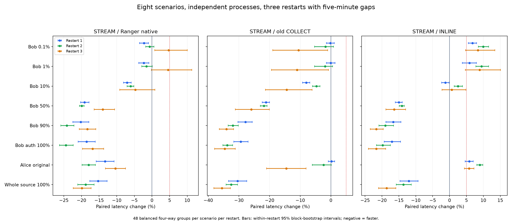

# 八场景、四方法、三次独立重启全量复测

本次恢复全部8个场景，比较最新STREAM、旧COLLECT、真实Ranger原生基线及INLINE；每轮结束确认测试进程退出后，等待至少5分钟再重启。未修改FGAC算法或引入结果缓存。

## 最后结论

1. **高返回率优势跨重启成立。** STREAM相对真实Ranger基线，90%三轮平均快20.88%，授权集合100%快19.93%，原始全表100%快17.97%。三轮方向一致，块长4与8的区间均在零以下；相对INLINE也分别快19.12%、19.51%、14.77%。这支持当前数据与部署下的收益，不能推广到任意引擎/数据布局。
2. **八场景等权平均快11.92%，但幅度不是固定常数。** 三轮分别快12.26%、14.18%、9.33%。不能把本轮与此前单轮快5.38%的差异归为新的代码优化，因为本轮未改算法，同时改变了重复部署、方法隔离与查询历史。
3. **小结果集没有固定11.5%的劣化，也未证明始终低于5%。** 0.1%和1%三轮平均分别慢0.62%、0.25%，第三轮分别慢4.74%、4.57%，主95%区间上界达到10.03%、11.31%；块长8上界为10.39%、12.36%。该轮前16组分别慢11.69%、13.56%，后续降低。这说明固定80次预热及5分钟重启间隔仍不足以保证所有小查询处于稳定状态。
4. **对5%目标应分场景判断。** 当前90%、授权100%、原始全表100%的三轮结果支持低于+5%；不能据总体平均或小场景均值宣称全部场景都稳定低于+5%。仅验证Spark3.5.8 local模式、当前窄表扫描/过滤/投影及统一摘要消费；R额外计算资源仍是接受的部署优势。

此前两场景专项复测与本轮全量混合的结论可以同时成立：小结果集常态接近原生，但特定运行阶段会出现明显拖尾。现在有证据说明单轮百分比和运行阶段有关，尚没有将JIT、GC、调度、共享服务及工作负载混合的影响全部单变量拆开。

## 三轮汇总

百分比为同轮配对耗时比值的平均，负数表示前者更快。先对场景等权，再对三次重启等权；另保存耗时加权结果。不能把不同轮次耗时交叉相除。

| 组别 | 第一轮STREAM/Native | 第二轮 | 第三轮 | 三轮等权平均 |
|---|---:|---:|---:|---:|
| 全部8场景 | -12.26% | -14.18% | -9.33% | -11.92% |
| 90%及授权100% | -19.37% | -24.27% | -17.57% | -20.40% |
| 0.1%及1% | -2.26% | -1.09% | +4.66% | +0.43% |
| 原始全表100% | -15.28% | -18.79% | -19.85% | -17.97% |

## 各场景稳定性

| 场景 | 第一轮STREAM/Native | 第二轮 | 第三轮 | 三轮平均 | STREAM/COLLECT三轮平均 | STREAM/INLINE三轮平均 |
|---|---:|---:|---:|---:|---:|---:|
| Bob 0.1% | -2.23% | -0.65% | +4.74% | +0.62% | -4.16% | +8.37% |
| Bob 1% | -2.29% | -1.54% | +4.57% | +0.25% | -4.33% | +8.09% |
| Bob 10% | -7.08% | -6.06% | -4.69% | -5.94% | -9.06% | +0.64% |
| Bob 50% | -19.11% | -19.91% | -13.92% | -17.65% | -23.01% | -15.17% |
| Bob 90% | -20.18% | -24.14% | -18.32% | -20.88% | -31.30% | -19.12% |
| Bob授权100% | -18.56% | -24.40% | -16.82% | -19.93% | -32.60% | -19.51% |
| Alice原场景 | -13.32% | -17.94% | -10.35% | -13.87% | -5.57% | +6.86% |
| 原始全表100% | -15.28% | -18.79% | -19.85% | -17.97% | -32.83% | -14.77% |

图示95%区间为每次重启内部3000次循环块bootstrap，块长4；summary.json同时保存块长8敏感性分析。区间不代表跨环境保证，也没有针对所有场景的多重比较做校正。只进行3次独立重启，因此同时展示轮间方向和幅度，不用窄的合并区间代替重复部署证据。

## 各轮耗时

| 重启 | 场景 | Native中位数ms | INLINE中位数ms | COLLECT中位数ms | STREAM中位数ms | STREAM/Native 95%区间 |
|---|---|---:|---:|---:|---:|---|
| 1 | Bob 0.1% | 360.10 | 332.96 | 349.33 | 350.21 | [-3.56%, -0.97%] |
| 1 | Bob 1% | 368.24 | 338.58 | 357.12 | 353.56 | [-3.77%, -0.88%] |
| 1 | Bob 10% | 417.78 | 393.61 | 422.10 | 382.95 | [-8.07%, -5.91%] |
| 1 | Bob 50% | 646.66 | 621.97 | 670.06 | 524.64 | [-20.23%, -17.85%] |
| 1 | Bob 90% | 855.47 | 827.21 | 950.69 | 691.86 | [-22.43%, -17.89%] |
| 1 | Bob授权100% | 883.35 | 867.41 | 1019.67 | 719.15 | [-20.94%, -16.09%] |
| 1 | Alice原场景 | 405.83 | 337.81 | 355.70 | 354.90 | [-15.80%, -10.75%] |
| 1 | 原始全表100% | 1048.77 | 1005.60 | 1261.66 | 881.30 | [-17.65%, -12.75%] |
| 2 | Bob 0.1% | 359.12 | 323.07 | 351.37 | 352.11 | [-1.76%, +0.59%] |
| 2 | Bob 1% | 365.78 | 330.73 | 359.24 | 355.00 | [-2.92%, +0.10%] |
| 2 | Bob 10% | 417.26 | 383.33 | 409.55 | 391.20 | [-7.07%, -5.12%] |
| 2 | Bob 50% | 646.09 | 598.82 | 666.84 | 516.34 | [-20.56%, -19.23%] |
| 2 | Bob 90% | 849.60 | 795.93 | 932.60 | 630.74 | [-25.86%, -22.13%] |
| 2 | Bob授权100% | 878.51 | 828.17 | 1013.53 | 652.38 | [-26.21%, -22.33%] |
| 2 | Alice原场景 | 431.23 | 323.51 | 352.59 | 352.41 | [-19.81%, -16.02%] |
| 2 | 原始全表100% | 1031.19 | 968.51 | 1242.14 | 815.02 | [-21.03%, -16.38%] |
| 3 | Bob 0.1% | 351.39 | 338.06 | 452.19 | 353.00 | [+0.81%, +10.03%] |
| 3 | Bob 1% | 356.88 | 341.81 | 456.75 | 358.83 | [-0.17%, +11.31%] |
| 3 | Bob 10% | 412.17 | 396.71 | 505.22 | 390.45 | [-9.14%, +0.83%] |
| 3 | Bob 50% | 626.37 | 644.70 | 765.37 | 528.07 | [-16.39%, -10.60%] |
| 3 | Bob 90% | 828.46 | 867.86 | 1047.14 | 684.24 | [-20.60%, -15.93%] |
| 3 | Bob授权100% | 859.59 | 906.88 | 1109.37 | 698.47 | [-19.69%, -13.67%] |
| 3 | Alice原场景 | 399.23 | 339.43 | 454.29 | 357.77 | [-13.21%, -7.50%] |
| 3 | 原始全表100% | 1083.72 | 1066.16 | 1371.88 | 848.45 | [-22.35%, -17.26%] |

## 测试口径与方法隔离

- 每轮48组×8场景×4方法=1536次正式查询，三轮4608次；每轮6个E会话各80次预热，共480次，三轮1440次。每场景四方法24种排列各出现2次，顺序随机且不同重启使用不同种子91901/91902/91903。
- E端COLLECT、STREAM、INLINE各有独立Spark/Python进程；Native按Bob、Alice、bench_full分成3个独立授权会话。R端COLLECT、STREAM各自独立Spark/Python、端点18844/18845、临时目录和事件日志，未共享SparkContext或Arrow队列。E临时目录按方法/身份隔离。
- 查询串行交错执行；每轮结束后全部E/R测试进程退出，再等待5分钟，再创建新进程。不是复用上一轮已预热JVM。
- 同一Iceberg快照6896028106384817739；原生采用Spark3.5.8＋Kyuubi AuthZ1.10.2＋Ranger2.5.0，执行真实行权限重写；INLINE将等价策略写入SQL，是非安全等价参照。Polaris与MinIO保持原部署。
- 四列VendorID、trip_distance、fare_amount、payment_type完整消费；count与双xxhash64摘要、流完成与关闭均计入耗时。所有预热及正式结果校验；每轮前中后验证快照，Ranger策略前后不变，并验证原生拒绝未授权用户、FGAC拒绝无效令牌。
- 最新STREAM与旧COLLECT均8192行/批、无压缩、相同消费者；E均local[2]/2GiB，FGAC另有R local[2]/2GiB。不限制总算力、不绑核，R额外算力属于接受的部署形态优势。
- 共用物理主机、存储与Catalog服务，保留正常暖缓存，不清除OS缓存或停止原业务。进程隔离不等于物理主机及共享缓存完全隔离，5分钟间隔也不等于冷缓存。
- 选择率指返回/授权集合；Bob授权100%约占原始表75.4%，与原始全表100%区分。此次恢复8场景混合，不能直接与此前仅0.1%/1%混合的平均值拼接。

## 五分钟间隔核验

| 前一轮 | 停止后至下一轮启动s | 单调时钟等待s |
|---|---:|---:|
| 1 | 299.996 | 300.000 |
| 2 | 299.994 | 300.000 |

restart-timing.json保存控制端起止时间与单调时钟时长；两段等待均从测试进程确认退出之后计时。是否满300秒以单调时钟判断，墙钟校时和分辨率可能产生毫秒级差异；下一轮启动请求晚于等待结束。等待期间不运行测试查询，正常后台业务与被动采样仍存在。

## 探针解释与尚未解决的问题

第三轮旧COLLECT出现额外运行时开销。以0.1%为例，前两轮端到端中位数349.33/351.37 ms，第三轮452.19 ms；R流阶段278.14/275.09 ms增至381.17 ms。R任务累计CPU约269.81/269.96/275.28 ms，源读取均8,493,289字节、2,964,624行；累计任务GC为0/0/31 ms。R进程CPU中位数从约466/455 ms增至5235 ms，正式区间COLLECT JVM平均占用从约0.71/0.67核增至2.19核。

这些指标支持GC等任务之外的运行时活动参与了第三轮COLLECT变慢，但不能把全部差值精确分配给GC：进程CPU包含GC、JIT和driver等，累计任务GC也不能直接相加成查询墙钟。该轮旧路径异常会放大STREAM/COLLECT收益，所以判断主要同时参照真实Native、INLINE及逐轮结果。

STREAM小结果集第三轮也有前后变化。0.1%前/中/后16组端到端中位数约372.54/350.51/340.85 ms；R流阶段298.49/278.92/273.27 ms；首批231.07/210.49/205.55 ms。1%对应端到端374.03/358.00/343.24 ms。这支持仍有运行阶段变化，不能用一个固定的网络或授权开销解释全部反转。

方法隔离在进程、SparkContext、端点及临时目录层面成立，测试查询串行；物理主机、CPU缓存、存储和Catalog仍共享。未停止其他业务，进程GC等后台活动也可能继续，故不声称各方法完全没有主机级相互影响。原始负载记录中存在其他Java/Doris/MinIO等进程，整机平均CPU不高不能证明无干扰。

后续若继续优化，应优先给R JVM增加GC/JIT及运行时停顿的细分探针，并对小查询的时间漂移做预先规定的稳态判定；不要再将通信字节减少或单轮更快直接等同于端到端稳定改善。本轮未新增TCP字节对照，Arrow逻辑字节不代表实际网络流量。

## 完整性与负载

Spark事件覆盖8832个查询组；失败任务/作业0，内存spill 0字节、磁盘spill 0字节。全部正式结果一致。

| 角色 | 重启 | 主机CPU均值 | 峰值 | iowait均值 | 换入/换出页 |
|---|---|---:|---:|---:|---:|
| R | 1 | 3.56% | 14.12% | 0.00062% | 0/0 |
| R | 2 | 4.51% | 12.06% | 0.00036% | 0/0 |
| R | 3 | 5.41% | 16.41% | 0.00035% | 0/0 |
| E | 1 | 3.03% | 6.73% | 0.00096% | 0/0 |
| E | 2 | 3.03% | 6.66% | 0.00095% | 0/0 |
| E | 3 | 2.99% | 6.79% | 0.00084% | 0/0 |

原业务服务健康与PID、E配置哈希已核验；测试进程和端口已清理。整机平均CPU不能排除局部核心、GC/JIT或短时调度影响，详细进程采样与各轮任务指标保留为证据。

## 复现与证据

- controller.py：三轮启动、清理、完整300秒等待及证据导出；SSH凭据通过交互输入，不写入脚本。
- benchmark.py、worker.py、manage_r.py、serve_compression.py：方法隔离、查询顺序与统一计时。
- summary.json / pairs.csv / group-summary.json / metrics.json：配对统计、分段结果及阶段耗时。
- stage-summary.json / stage-validation.json / probe-summary.json：Spark任务及交付证据。
- restart-timing.json / protocol-validation.json：间隔、顺序、快照与结果检查。
- 大体积证据在R `/data1/lyb/fgac-lab/runs/full-alignment-0915/`、E `/home/lyb/fgac-lab/runs/full-alignment-0915/` 的evidence-R/E.tar.gz。解压至本地r/e后依次运行analyze.py、analyze_stages.py、analyze_load.py、aggregate.py、analyze_groups.py、plot.py、make_report.py。依赖既有部署的Spark/Polaris/Ranger及受保护凭据。
