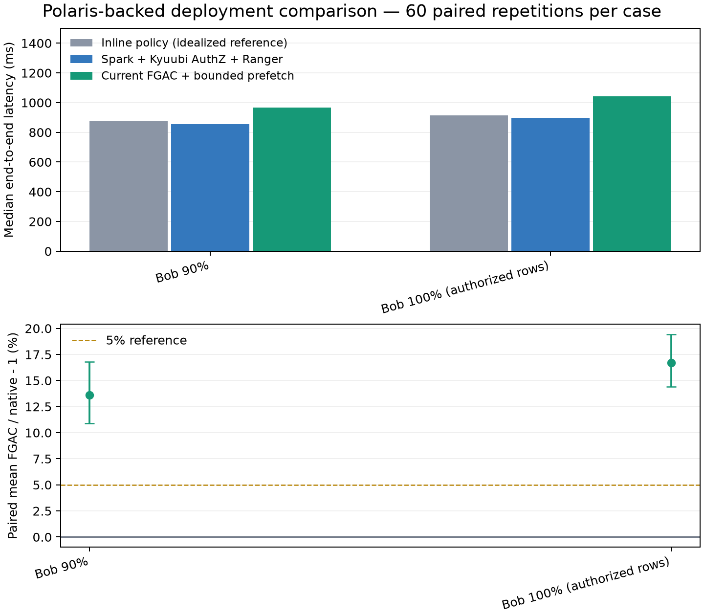

# 高返回比例场景独立复测

2026-09-15。按用户确认，仅复测当前环境的 Bob 90% 和授权集合 100% 两个场景；没有复测昨天的旧部署，没有复测原表 100% 场景。

## 结果

**高返回比例下 FGAC 慢于原生的结论得到复现；上轮的 14.97% / 19.18% 不应理解为固定常数。** 本轮分别为 +13.62% / +16.68%，上轮两个点估计均在本轮区块 bootstrap 95% 区间内。两场景区间下界均超过 5%，本轮也没有达到 5% 目标。这不是两轮性能等效的统计证明。

全部 360 次正式查询、120 次预热成功，行数、字段类型、双 xxhash64 摘要逐组一致。160 次 FGAC 流完成审计。三条路径为当前最优 FGAC、Spark + Kyuubi AuthZ + Ranger、直接写条件的 INLINE 参考。

耗时是独立中位数，单位 ms；劣化是 60 组配对比值 FGAC/native−1 的算术平均，不能直接用中位数之比复算。95% 区间采用长度 5 的循环移动区块 bootstrap，保留短期时间相关性；普通配对 bootstrap 区间和 P95 同时保存在 summary.json。

| 场景 | 原生中位数 | FGAC 中位数 | INLINE 中位数 | 配对平均劣化 | 区块 bootstrap 95% 区间 |
|---|---:|---:|---:|---:|---:|
| bob_90 | 854.9 | 967.1 | 873.7 | +13.62% | [+10.88%, +16.78%] |
| bob_100 | 896.4 | 1043.6 | 912.9 | +16.68% | [+14.40%, +19.43%] |

## 与上一轮比较

上一轮指今天完成预热公平性修正后的 30 组测试，不采用初始预热不足的诊断轮。前后使用相同 FGAC 服务、相同实现与设置；本轮重新启动 E 测试会话，单独交错执行两个高返回比例场景。场景组合从八种变为两种，随机顺序种子改变，因此是独立可靠性复核，并非完全相同工作负载时序的逐项重放。

| 场景 | 上轮劣化 | 本轮劣化 | 原生中位耗时变化 | FGAC 中位耗时变化 |
|---|---:|---:|---:|---:|
| bob_90 | +14.97% | +13.62% | -3.39% | -4.90% |
| bob_100 | +19.18% | +16.68% | -2.29% | -3.66% |

连续 20 组的配对平均：

| 场景 | 第 1–20 组 | 第 21–40 组 | 第 41–60 组 |
|---|---:|---:|---:|
| bob_90 | +15.13% | +10.19% | +15.54% |
| bob_100 | +19.27% | +17.61% | +13.17% |

100% 场景三个区块约为 19.27%、17.61%、13.17%，仍存在运行漂移，不能声称预热后完全平稳。报告保留全部样本，没有仅截取更快的后半段。90% 场景约为 15.13%、10.19%、15.54%，不是持续单向下降。

INLINE 本轮中位数比原生慢约 2%，而上一轮更快；INLINE 自身相对上一轮变慢约 6%–7%。它只移除了授权插件，不能保证独立 JVM 会话在每轮都更快。当前证据没有把这一变化唯一归因于 JIT、GC 或系统噪声，所以不将它宣称为稳定的实测“性能上限”，也不据此断言 Ranger 能加速查询。此变化是跨轮不确定性的具体表现。

区间只代表本次运行内的采样变化，不包含跨次运行、其他负载和工作负载组合的全部变动。不能将两次观测间的差异直接认定为代码回归或单一节点故障，也不能只保留更有利的一轮。

## 执行口径与可靠性检查

- 同一 Polaris 表快照 6896028106384817739、同一四个数值字段、同一 Bob 行权限 VendorID=2。
- 90% 场景为 trip_distance >= 0.65，输出 2,011,899 行；100% 场景不加业务过滤，输出授权集合 2,234,632 行，占原表约 75.4%，不是原表全量。
- 每个场景 20 组预热，使三个 E Spark 会话各完成 40 次预热；之后每场景 60 组正式测量。六种路径顺序各出现 10 次，场景顺序交错随机化，种子 91502。
- 所有模式都从构造 SQL/Flight describe 前计时，包含完整四列双摘要消费和资源关闭。没有后验摘要、空消费或 count-only 替代。
- 不限制 FGAC 总计算资源，不绑核、不加 CPU 配额；保持 E local[2]、R local[2] 和既有最优方案设置。保留常驻 R 服务与正常元数据、策略和 OS 缓存。
- 未修改 FGAC 算法、未重启既有部署、未生成 Parquet 结果。原生无权限身份及 FGAC 无效 token 均拒绝；正式样本不剔除。
- 运行前后及每 10 组核对快照；运行后核对 Ranger 策略、原服务 PID、健康接口。源码散列保存在 r/e 的 source-manifest.json。

## 阶段与源读取探针

prepare / action 为各自阶段的中位数，单位 ms。prepare 之后还有摘要计划构造，阶段中位数不可直接相加还原整体中位数；R/E 流水阶段也不可简单相加。

| 场景 | 原生 prepare / action | FGAC prepare / action | Arrow 逻辑字节 |
|---|---:|---:|---:|
| bob_90 | 17.8 / 784.2 | 45.3 / 886.1 | 56,333,172 |
| bob_100 | 16.8 / 829.2 | 40.0 / 965.8 | 62,569,696 |

| 场景 | 位置 / 模式 | 输入记录 | 输入字节 | 任务 CPU ms | GC ms |
|---|---|---:|---:|---:|---:|
| bob_100 | E/NATIVE | 2,964,624 | 8,296,681 | 1151.2 | 9.0 |
| bob_90 | E/NATIVE | 2,964,624 | 8,493,289 | 1091.7 | 10.0 |
| bob_100 | E/INLINE | 2,964,624 | 8,296,681 | 1133.4 | 10.0 |
| bob_90 | E/INLINE | 2,964,624 | 8,493,289 | 1067.2 | 10.0 |
| bob_100 | E/FGAC | 2,234,632 | 0 | 989.4 | 10.0 |
| bob_90 | E/FGAC | 2,011,899 | 0 | 889.2 | 8.0 |
| bob_100 | R/FGAC | 2,964,624 | 8,296,681 | 735.5 | 52.0 |
| bob_90 | R/FGAC | 2,964,624 | 8,493,289 | 703.2 | 15.0 |

源输入字节是 Spark 输入指标，Arrow 字节是逻辑数据量，均不能直接当作网卡实测线上字节。R 端源扫描、格式转换、流输出及 E 接收消费存在重叠，当前探针不能将全部额外墙钟时间单独归因于网络。

640 个常规预热及正式 E/R 查询组已逐一核对 Spark 事件，无失败作业或任务，无内存或磁盘 spill；事件导出按作业时间和 Remote 唯一 job_id 关联，避免与保存的上一轮同名查询混淆。资源采样见 resource-summary.json，逐组耗时与结果见 formal/records.jsonl，完整比较见 comparison.json。

## 文件与部署

R 证据：`/data1/lyb/fgac-lab/runs/high-return-recheck-0915`；E 证据：`/home/lyb/fgac-lab/runs/high-return-recheck-0915`。报告只使用新目录，不覆盖上一轮证据。测试结束后 E worker 退出，R FGAC 与原有服务保留运行。

本次数据不能单独回答昨天到今天的部署变化为何引起差异；该问题需要另行对照旧部署或逐项切换变量。本报告不把本轮两个场景平均推广为通用工作负载性能。
