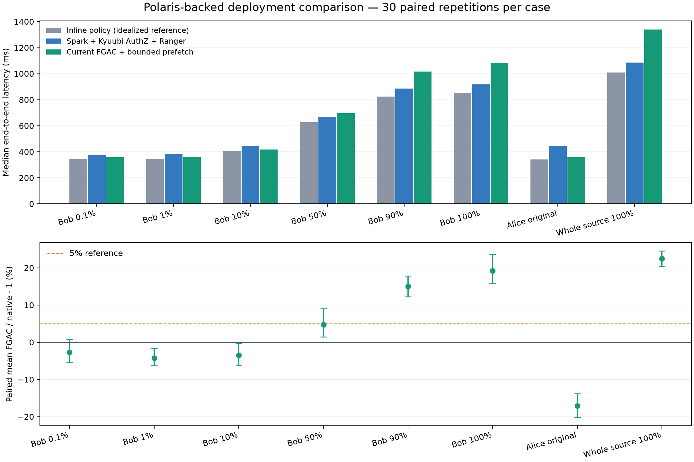

# 当前 FGAC 与 Spark + Kyuubi AuthZ + Ranger 性能复测

日期：2026-09-15。当前 FGAC 流式方案已部署到隔离实验环境，三条路径已完成统一口径复测。**资源采用实际部署形态：不限制 FGAC 两侧总资源、不绑核、不设 CPU 配额。**

## 结论

- 原七场景等权配对平均劣化为 **+1.63%**，新增原表全量后八场景为 **+4.24%**。负值表示 FGAC 更快；这是本测试集合的等权结果，不是任意业务负载的平均。
- 授权集合 100% 返回为 **+19.18%**，原表 100% 返回为 **+22.50%**。应据此单独判断全量场景的 5% 目标，不能用混合平均替代。
- 原表全量 FGAC 相对直接填写条件的理想化参考仍有 **+32.00%** 的开销。该参考保留 Polaris 和同一源表读取，但没有授权插件，不是安全等价基线。
- 正式 720 次查询、常规预热 120 次、额外会话预热 80 次均成功。三路径的行数、四列类型和双摘要一致；280 次 FGAC 流均有完成审计；未剔除正式样本。

## 部署与公平性

| 项目 | 配置 |
|---|---|
| R（外部 SSH 10023） | 172.168.22.23；`/data1/lyb/fgac-lab`；MinIO 19100、Polaris REST 18182、FGAC 授权兼容接口 18184、Arrow Flight 18815 |
| E（外部 SSH 10025） | 172.168.22.25；`/home/lyb/fgac-lab`；Spark + Kyuubi AuthZ + Ranger；Ranger Admin 仅监听 127.0.0.1:16080 |
| 引擎 | Spark 3.5.8、Java 11.0.32、Iceberg 1.7.2；三条路径 E Spark 均 local[2]、Driver 2 GiB；FGAC 额外 R Spark local[2]、Driver 2 GiB |
| 原生授权 | Kyuubi AuthZ 1.10.2、Apache Ranger 2.5.0，独立服务 `fgac_bench_0915`；业务 SQL 不预填行权限 |
| 元数据 / 数据 | Polaris 1.7.0 + PostgreSQL；共同使用 MinIO 上同一 Iceberg 表及快照 6896028106384817739 |
| 最新 FGAC 来源 | 仓库 `prf-test-0915`，提交 `03cd01bdbc6787b0f36e0f3cca41d10fe4e56769` 的 streaming 实现；常驻 R Spark、Arrow Flight、2 批 / 16 MiB 有界预取 |

FGAC 的新增 R 端计算资源属于用户认可的部署优势。本轮保留此优势，同时报告 CPU 和内存成本；没有把总算力相等设为公平性条件。公平性约束落在相同数据快照、行权限含义、业务条件、字段、完整结果消费及计时边界上。

原生路径通过 Ranger 策略和 Kyuubi 重写；保存的原始执行计划可见 `RowFilterMarker`，优化后与 INLINE 的 VendorID 和业务过滤条件一致。Polaris 负责共享 Iceberg 元数据；FGAC 的授权仍由现有兼容接口提供，**没有宣称把 FGAC 授权原生迁移进 Polaris**。

本次只部署 Kyuubi AuthZ 插件，没有部署完整 Kyuubi SQL/Thrift Server。测试以受控 `HADOOP_USER_NAME` 身份运行，不评估生产登录认证。Ranger 保留正常策略缓存/轮询；FGAC 保留两次授权复核，因此固定策略下结果权限等价，但撤权生效时延并未统一，也未测试。

新增原表全量主体使用显式 `row_filter: {op: all}` 授权，适配层识别该授权后返回原 DataFrame；已有 eq 策略仍走原编译器。它没有绕过 Remote Spark、直传原始 Parquet、缓存结果或新增全量专用快速路径。Java 接收桥沿用原源码，重新编译为 Java 11 字节码。

## 测试口径

保留旧七场景，另增原表全量场景。表共 2,964,624 行，Bob 授权集合为 VendorID=2 的 2,234,632 行，Alice 为 VendorID=1 的 729,732 行。返回比例是输出行数 / 授权集合行数；Bob 的 100% 只占原表约 75.4%。

统一返回 `VendorID, trip_distance, fare_amount, payment_type` 四个原始数值字段。计时从构造 SQL DataFrame / Flight describe 之前开始，到四列完整消费并完成行数和双 xxhash64 摘要、关闭流结束。摘要不是计时后的附加工作，也没有只 count 而忽略字段读取。完整 SQL 和 FGAC 计划见 `formal/records.jsonl`、`formal/cases.json` 及 `formal/*_plan.txt`。

每场景 5 组常规预热、30 组正式测量；正式前每个 E Spark 会话至少完成 40 次预热。六种路径顺序每场景各出现五次，场景交错随机化，种子 915。保留正常元数据及 OS 缓存，不清空系统缓存；无 DataFrame persist/cache、无结果缓存。测试为常驻服务暖态、单查询负载。

## 性能结果

三列耗时均为各路径独立中位数，单位 ms。劣化列是同组 FGAC / 基线 - 1 的平均值，**不是两个中位数之比**；方括号为配对比值重采样 95% 区间。

| 场景 | 输出行数 | 直接条件 INLINE | 原生 Ranger | 当前 FGAC | 相对原生劣化及 95% 区间 | 相对 INLINE |
|---|---:|---:|---:|---:|---:|---:|
| Bob 0.1% | 2,243 | 342.8 | 375.1 | 357.1 | -2.68% [-5.49%, +0.76%] | +6.17% |
| Bob 1% | 22,400 | 343.6 | 384.4 | 360.9 | -4.22% [-6.16%, -1.63%] | +5.23% |
| Bob 10% | 223,731 | 404.5 | 445.3 | 418.4 | -3.46% [-6.17%, -0.32%] | +5.57% |
| Bob 50% | 1,122,053 | 626.0 | 669.4 | 694.7 | +4.73% [+1.48%, +9.03%] | +12.33% |
| Bob 90% | 2,011,899 | 823.7 | 885.0 | 1017.0 | +14.97% [+12.22%, +17.84%] | +22.47% |
| Bob 100%（授权集合） | 2,234,632 | 854.7 | 917.4 | 1083.2 | +19.18% [+15.87%, +23.58%] | +26.71% |
| Alice 原场景 | 36,149 | 340.8 | 446.3 | 358.9 | -17.11% [-20.16%, -13.66%] | +6.60% |
| 原表 100% | 2,964,624 | 1010.0 | 1085.8 | 1338.9 | +22.50% [+20.39%, +24.53%] | +32.00% |

| 汇总范围 | 配对平均劣化 | 5 组循环移动区块 bootstrap 95% 区间 | 总耗时之比 - 1 |
|---|---:|---:|---:|
| Bob 六档返回比例 | +4.75% | [+2.81%, +7.07%] | +8.01% |
| 原七场景等权 | +1.63% | [-0.40%, +4.12%] | +5.25% |
| 含新增全表场景的八场景等权 | +4.24% | [+2.36%, +6.56%] | +8.84% |

不同汇总指标权重不同：等权平均回答“等概率选一个场景的相对劣化”，总耗时比更偏重耗时较长的场景。置信区间仅反映这次运行的采样变动，不能覆盖机器、数据集或部署变化。

连续十组的配对平均，用于观察运行漂移：

| 范围 | 第 1–10 组 | 第 11–20 组 | 第 21–30 组 |
|---|---:|---:|---:|
| 原七场景 | -1.04% | +3.62% | +2.32% |
| 八场景 | +1.57% | +5.99% | +5.15% |

## 探针解释

原表 100% 的 Spark 任务指标如下。CPU 是各任务 CPU 时间之和，不能与墙钟阶段耗时直接相加；输入字节是 Spark 读取指标，不等于网卡线上字节。

| 执行位置 / 路径 | 源输入行数 | 输入字节 | 任务 CPU ms | GC ms | 磁盘 spill 字节 |
|---|---:|---:|---:|---:|---:|
| E-NATIVE | 2,964,624 | 8,100,073 | 1346.7 | 12.0 | 0 |
| E-INLINE | 2,964,624 | 8,100,073 | 1321.1 | 12.0 | 0 |
| E-FGAC | 2,964,624 | 0 | 1478.8 | 12.0 | 0 |
| R-FGAC | 2,964,624 | 8,100,073 | 852.2 | 24.0 | 0 |

原表全量 FGAC Arrow 逻辑数据量中位数为 83,009,472 字节；源扫描字节中位数为 8,100,073。因此流式传输虽避免结果 Parquet 落盘，仍需要 Parquet 解码、Arrow 输出、接收桥转换以及 E Spark 消费，流式并不意味着传输零成本。

全量 FGAC 的 E+R 进程 CPU 时间中位数为 5226.4 ms，原生 E 为 2010.7 ms。该进程指标包含各自 Python/JVM 的工作；不是 CPU 配额，也不包含独立 Catalog/MinIO/Ranger 进程。FGAC prepare 中位数 35.1 ms、action 1264.8 ms，原生分别 17.7 / 1014.8 ms。阶段可能重叠，不能将 R 与 E 的墙钟耗时简单累加。

本数据布局下，三种源扫描路径均读取约 296 万源记录；原生与 INLINE 的过滤计划虽可下推，实际没有显著减少源读取记录。不能据此推断 Catalog 不具备裁剪能力；本轮没有覆盖分区/行组分布良好的大规模裁剪数据集。

全部正式及常规预热对应 1,120 个 E/R 查询组的事件已校验，无失败任务或作业、无内存/磁盘 spill。原始事件中携带配置的内容未直接导出，证据包内为脱敏后的事件筛选结果。额外 80 次预热单独保存并验证结果，不混入性能统计。

被动采样中 R FGAC Python+JVM 合计峰值 RSS 为 3389 MiB。各 E 会话峰值及主机 CPU 见 `resource-summary.json`；主机指标包含已有服务和其他活动，不能当作 FGAC 独占成本。Driver 2 GiB 是 JVM 堆设置，并非 Python、堆外内存与 JVM 合计上限。

## 复核与限制

第一轮已完成，但发现按场景预热会使原生 Alice / Bob / 全量会话只预热 5 / 30 / 5 次，而共享 FGAC、INLINE 各 40 次。该轮原七场景汇总为 -3.57%，只作为诊断数据保留在 `initial-*`。最终主结果来自补齐预热后的整轮重跑；没有改变 FGAC 算法、筛掉慢样本或根据结果挑选实现。即便预热次数一致，JIT 与正常运行波动仍可能存在，故同时报告区块结果。

本轮验证的是 NYC Taxi 当前约 296 万行表的扫描、行过滤、四列投影及统一摘要消费；不等价于 TPC-DS/TPC-H 认证结果，不覆盖 join、复杂类型、宽表、并发或冷启动。原表全量场景用于评估不下推最终消费计算的传输成本，但没有覆盖所有“不可修改引擎”的实际业务。当前 E 接收桥依旧是 Spark 适配器；不能由本轮推断 Daft/Trino 零适配可用。

本轮部署与计时是性能比较，不声称实现了生产级身份认证或完整安全认证。原生拒绝无权限身份、FGAC 拒绝无效 token 的负向控制均已通过；未测试任意绕过路径和动态撤权。

## 可复现资料与运行维护

- `TEST_PROTOCOL.md`：统一口径；`formal/`：计时明细、SQL、计划、快照及负向控制；`summary.csv` / `pairs.csv`：汇总和逐组比较。
- `r/`、`e/` 及 `evidence-R.tar.gz` / `evidence-E.tar.gz`：审计、探针、脱敏事件和源码散列；`stage-validation.json`：事件校验结果。
- `benchmark.py`、`worker.py`、`analyze*.py`、`make_report.py`：测试与分析源码。受保护的凭据文件保留在远端 lab，不随报告发布。
- R 查看服务：`python3 /data1/lyb/fgac-lab/deploy/labctl.py status`；新服务名为 `fgac-current` 和 `fgac-benchmark-auth`。
- E 启动入口：`/home/lyb/fgac-lab/deploy/fgac-current/spark-current.sh native|inline|fgac job.py`。原生测试需设置相应受控身份；现有策略仅授权本轮四列。

R Remote、共享存储、Polaris 与 E Ranger 保留运行；测试用 E worker 已退出。旧部署未重启，原 Catalog、Remote、Spark 和 MinIO 的原 PID 仍在，健康接口正常。新 lab 的共享数据未增加结果对象前缀。最终健康与策略未变检查见 `r/final-health.json`、`e/final-health.json`。
