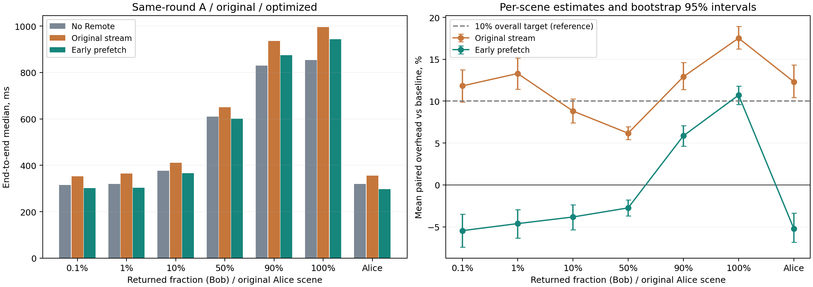

# 保持通用性的流式优化：第 1 轮复测

日期：2026-09-14。预先确定目标：七个场景等权、每个场景 30 组正式测量，逐组计算优化后流式 / 无 Remote 基线 − 1，其算术平均小于 10%。最多进行五轮优化与测试；达到目标后停止继续优化。

## 实施内容

本轮采用客户端有界提前预取：GetFlightInfo 返回后立即通过正常 DoGet 启动读取，用独立线程缓存少量 Arrow RecordBatch，同时让消费引擎准备。原路径在 E 两个 Spark 读取任务连接本机 socket 后才执行 DoGet，形成可重叠的等待。

修改位于 streaming/client.py，新 API 为 GovernedClient.prefetch(info)。协议、ticket、两次授权检查、计划编译、类型、数据内容与顺序均未变；原 scan() API 保持不变。没有引入 Spark 私有对象到协议，没有删除脱敏/过滤，也没有改动 Remote 的计算后端。

本轮收益主要来自等待重叠，不代表总 CPU 同比下降。流式同时使用 E/R 两侧计算资源，无 Remote 主要由 E 计算；结果不是总计算资源完全相同的比较。

预取 SDK 不依赖 Spark，接入端需在确认查询即将执行时主动调用；这不意味着所有 Spark/Daft/Trino 客户端会自动获益，也不是已经完成各引擎的正式插件。不能在只有元数据探测需求时自动执行扫描。

队列容量为 2 个批次、16 MiB 排队预算；大于预算的单个批次允许独占空队列，生产者还可持有一个待入队批次。预算不覆盖 Flight、Spark 内部缓存。关闭上下文会取消读取，生产者失败会传播给消费方。

## 同轮结果

A：动态 Catalog 授权和部署版 PlanCompiler 的无 Remote 基线；U：优化前流式；O：提前预取流式。U/O 使用同一个独立 R 服务和同一个 E Spark 会话，两者接收端 IPC、2 个输入分区及全列双摘要完全相同。唯一性能变量是是否提前有界预取。

本轮没有重测 Parquet Remote，它不参与优化目标；U 是优化前流式，不能与此前报告中代表 Parquet Remote 的 B 混淆。

正式执行 630 次，组成 210 组 A/U/O 对照；另有 105 次预热和 21 次冒烟。每个场景的六种执行顺序各出现五次，场景间也交错随机化。全部 245 组含预热结果的行数、字段名称/类型和双摘要一致。

|场景/返回比例|A 中位数，ms|U 中位数，ms|O 中位数，ms|U 平均劣化|O 平均劣化|O 对 U 平均节省，ms|
|---|---:|---:|---:|---:|---:|---:|
|0.1004%|315.92|352.57|301.52|11.82%|-5.45%|55.61|
|1.0024%|319.68|364.08|303.73|13.30%|-4.62%|57.66|
|10.0120%|376.78|410.51|365.72|8.82%|-3.83%|48.15|
|50.2120%|610.53|650.53|601.31|6.17%|-2.74%|54.88|
|90.0327%|829.08|936.15|874.47|12.91%|5.86%|58.77|
|100.0000%|853.35|995.86|942.52|17.52%|10.71%|58.47|
|alice 原场景|320.14|355.23|296.91|12.31%|-5.21%|56.32|

耗时列为独立中位数；劣化列为每组配对比值的算术平均，不能直接用表中两个中位数相除复算。

优化前平均劣化 **11.84%**；优化后 **-0.75%**，按场景分层 bootstrap 的 95% 区间为 **-1.32%–-0.18%**。平均每次节省 **55.69 ms**。

把所有正式查询耗时相加后再相除，优化后相对基线为 **1.61%**，该指标不是本轮预先指定的主要验收指标。

第 1 轮已达到预先约定的平均目标，因此停止继续优化，未进行第 2–5 轮。这里是平均验收，不是每个场景均低于 10%：全量场景仍有 10.71% 的配对平均劣化。

## 为什么改善

|场景|U 首批到 E，ms|O 首批到 E，ms|U 等待下一批累计，ms|O 等待队列下一批累计，ms|
|---|---:|---:|---:|---:|
|0.1004%|234.73|183.33|233.00|180.80|
|1.0024%|240.46|184.55|238.33|185.95|
|10.0120%|267.54|216.51|273.10|229.92|
|50.2120%|379.91|323.48|450.41|388.32|
|90.0327%|482.69|425.09|603.61|518.48|
|100.0000%|505.66|448.75|629.85|540.31|
|alice 原场景|238.34|179.30|235.66|180.06|

U 首批记录为原读取线程收到批次，O 为预取线程收到批次。O 的等待下一批为队列等待，不是网络等待；后台读取及背压分别在 prefetch_read_ms/prefetch_backpressure_ms 中记录。并行阶段不能相加为端到端时间，也不能把所有提前量解释为网络加速。

探针复核 U/O 每次都读取 2,964,624 条源记录并执行 3 个 R 扫描任务；正式/预热期间无失败 Spark 任务。各场景首批平均提前约 52–59 ms，与端到端平均节省约 56 ms 相符，支持启动重叠的解释。

没有提前到计时器之外工作：计时从授权/元数据请求之前开始，覆盖 DoGet、后台读取、引擎准备、完整摘要及资源关闭。没有预下载整个结果、持久化结果、缓存摘要或用 noop 替代计算。

## 稳定性

|连续十组区块|优化前平均劣化|优化后平均劣化|
|---|---:|---:|
|1|12.23%|-1.47%|
|2|11.25%|-0.83%|
|3|12.04%|0.04%|

置信区间使用 10,000 次固定种子、按场景分层的配对重采样。区间只反映本轮样本，未包含跨日负载、时间相关性或不同数据集的不确定性。源码测试覆盖 15 项身份、策略、错误、空结果、背压和取消行为；性能数据仅覆盖当前四个数值字段与无序 scan/filter/project。

## 仍然存在的限制

- R 的 ColumnarToRow → Arrow 转换和 collectAsArrowToPython 分区聚集仍存在，本轮没有声称消除这两个瓶颈。
- E 的测试用本机 IPC 适配器仍存在；减少的是启动阶段的串行等待。
- 单服务仍只支持一个活跃扫描，尚未验证多客户端竞争下的吞吐与尾延迟。
- 使用一次性 ticket、原有租约和授权复核；未加入自动重试或断点续传。
- 预取会让最终取消的查询提前消耗部分 R 资源，因此必须在确定执行时启用，并及时关闭。

## 部署保护与证据

源码已提供新的预取 API 和使用说明；本轮只验证隔离客户端接入，未替换既有生产客户端或服务。

只在 /tmp/fgac-stream-opt-20260914 运行独立服务和测试会话；原生产 Remote/Catalog/MinIO 未重启、未替换，原源码哈希与 PID/启动时间在测试后复核。测试没有生成 Parquet 结果前缀，没有修改源表或策略。
表快照为 6896028106384817739，策略版本为 2；U/O 服务端共 490 次正式/预热审计按完成顺序和 plan_hash 关联，主体、行数及批次均核对一致。

文件：round1/overall.json、summary.csv、pairs.csv、comparisons.json、verified_records.json、validation.json；R 审计为 r/audit.jsonl、stages.jsonl；单元测试为 unit_tests.txt。
